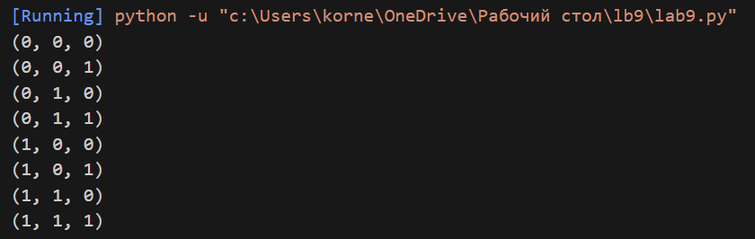

# Лабораторная работа №9.
## Генераторы
### Задание
Генератор, создающий все возможные уникальные комбинации элементов из нескольких последовательностей.
```python
from itertools import product

def unique_combinations(*sequences):
    for combination in product(*sequences):
        unique_combination = combination
        yield unique_combination

# Пример использования:
seq1 = [0, 1]
seq2 = [0, 1]
seq3 = [0 ,1]

for combination in unique_combinations(seq1, seq2, seq3):
    print(combination)
```
Это пример показывает, как использовать функцию unique_combinations для генерации всех возможных уникальных комбинаций элементов из трех последовательностей: seq1, seq2 и seq3. Вы можете добавить или удалить последовательности в вызове функции unique_combinations, чтобы адаптировать его под ваши задачи.

### Результат программы

